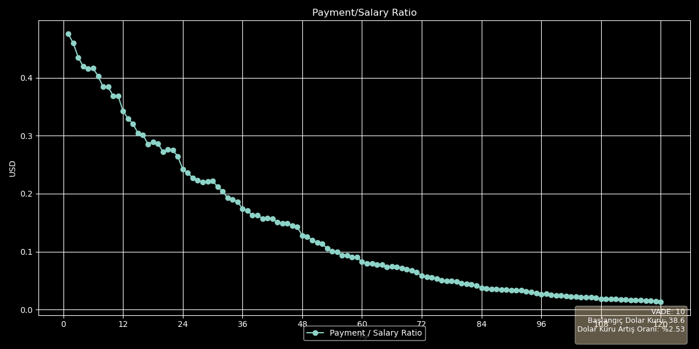
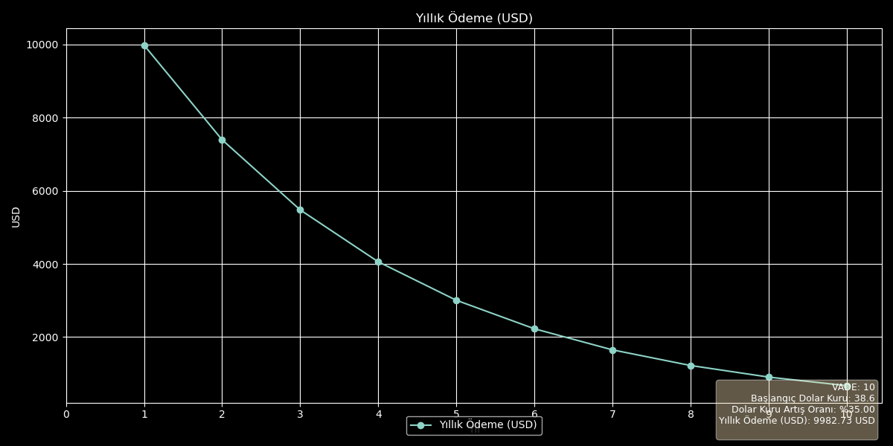

# 🏠 Real Estate Projection

A powerful web application for analyzing and projecting real estate investments, mortgage payments, and salary growth over time. The application supports both English and Turkish languages.

## 🌐 Live Demo

Try the application here: [Real Estate Projection App](https://realestateprojection-awqwcafqdbessxurbqezxn.streamlit.app/)

## 📊 Features

- **Bilingual Support**: Full English and Turkish language support
- **Flexible Analysis**: Choose between monthly and yearly views
- **Comprehensive Parameters**:
  - Mortgage calculations
  - Salary projections
  - Currency conversions (EUR, USD, TL)
  - Inflation considerations
  - Random dollar value generation
- **Multiple Visualization Options**:
  - Mortgage payments
  - USD/TL exchange rates
  - Salary projections
  - Cumulative payments
  - Total credit amount
  - Property value
  - Payment/Salary ratio

## 📈 Example Visualizations

### Monthly View


### Annual View


## 🛠️ Technical Details

- Built with Streamlit
- Python-based calculations
- Matplotlib for visualizations
- Responsive design
- Dark/Light theme support

## 💡 How to Use

1. Adjust the parameters in the control panel
2. Select your salary currency (EUR, USD, or TL)
3. Choose whether to include inflation in calculations
4. Select which plots you want to display
5. Click "Generate Plot" to create the visualization
6. The plot will appear in the right columns and can be downloaded

## 🔧 Installation

1. Clone the repository:
```bash
git clone https://github.com/yourusername/RealEstateProjection.git
```

2. Install the required packages:
```bash
pip install -r requirements.txt
```

3. Run the application:
```bash
streamlit run app.py
```

## 📝 Requirements

- Python 3.7+
- Streamlit
- NumPy
- Matplotlib
- Pandas

## 🤝 Contributing

Contributions are welcome! Please feel free to submit a Pull Request.

## 📄 License

This project is licensed under the MIT License - see the LICENSE file for details.
